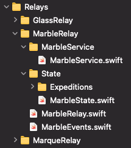

# GraniteRelay

```swift
public struct MarbleRelay: GraniteRelay {
    @ObservedObject
    public var command: GraniteService<MarbleCenter, MarbleState> = .init()
    
    public init() {}
    
    public func setup() {}
    
    public func clean() {}
    
    public func cancel() {}
}
```

A **GraniteRelay** is a Service, that can be attached to GraniteComponent's Center. Acting as a microservice for many components at a time, with it's Expeditions able to be reached from within the Expeditions of Granite Components themselves.

```swift
public class ExhibitionCenter: GraniteCenter<ExhibitionState> {
    let marbleRelay: MarbleRelay = .init()
}
```

This is an example Component's Center initializing a Relay. That's all that is needed for the Component to readily recognize it's presence and utilize it's utility for within the Component's business logic layer.



A standard `GraniteRelay` template spawns a folder structure similar to above. `Expeditions` are added later to handle specific business logic this Relay is expecting.

### GraniteState
```swift
public class MarbleState: GraniteState {
    let service: MarbleService = .init()
    var atlas: Atlas? = nil
}

public class MarbleCenter: GraniteCenter<MarbleState> {
    public override var expeditions: [GraniteBaseExpedition] {
        [
            AtlasExpedition.Discovery(),
            AtlasStopExpedition.Discovery(),
        ]
    }
}
```

A state file consists of two important classes. The `State` and the `Center` that are used to initialize the `GraniteService` `ObservedObject` we saw in the beginning of this page. 

As a simple practice, creating a seperate class to act as a hub for generating networking publishers is recommended. As seen in the `MarbleService`.

### GraniteEvent

```swift
public struct Atlas: GraniteEvent {
        
    public struct Request: GraniteEvent {
        public var behavior: GraniteEventBehavior {
            .quiet
        }
        public var beam: GraniteBeamType {
            .rebound
        }
        public var async: DispatchQueue? {
            MarbleEvents.atlasQueue
        }
    }
```

GraniteEvents in Relays have additional settings that can be used to properly trigger events without causing additional component draw calls. Allowing for increased data throughput, while maintaining State changes in the linked Component.


### GraniteEventBehavior

```swift
public enum GraniteEventBehavior {
    case passthrough
    case broadcastable
    case quiet
    case none
}
```

For relays, generally `broadcastable` and `quiet` are the useful behaviors to set. `broadcastable` allows Relays that are initialized higher in a Component tree, to send events to all child Components that are ready to hear `broadcasts`. This allows for 1 service to be initialized while affecting the composition of many Components at the same time, depending on it's relevant broadcastable Expeditions.

`quiet` sends updates back to its linked Component, updating the state while not affecting the render cycle of the target Component.

### GraniteBeamType

```swift
public enum GraniteBeamType {
    case rebound
    case broadcast
    case contact
    case none
}
```

`rebound` directly sends any side effects with the relevant Event from the Relay's expedition to the linked Component that contacted the Relay. The linked Component will have an Expedition set to the GraniteEvent Type in question to immediately execute.

`broadcast` behaves in a similar intention as `GraniteEventBehavior` except a behavior ...